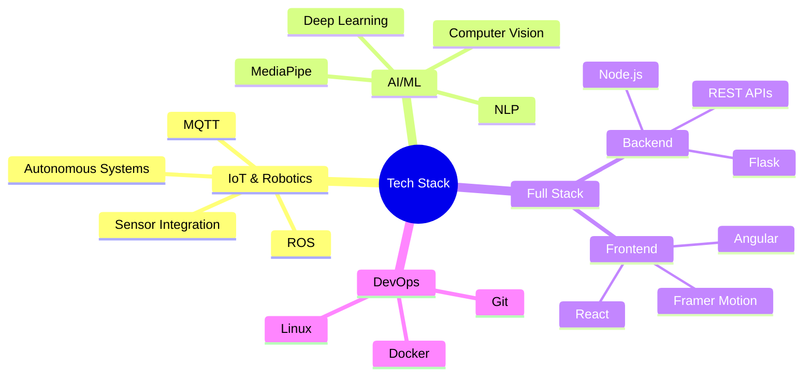

<h1 align="center">
  
</h1>

  

 

  const sujan = {
    title: "IoT & AI/ML Engineer",
    education: "B.Tech CSE (IoT) @ Shiv Nadar University",
    location: "Chennai, India",
    code: ["Python", "JavaScript", "C++", "SQL"],
    interests: ["Autonomous Systems", "Deep Learning", "Robotics"],
    currentlyWorking: {
      focus: "Advanced AI/ML Applications",
      tools: ["ROS", "Transformers", "MediaPipe"],
      domains: ["Computer Vision", "NLP", "IoT"]
    }
  };
 
  

## 🎯 Expertise Zones

<table align="center">
  <tr>
    <td align="center" width="100">
      
       Python
    </td>
    <td align="center" width="100">
      
       React
    </td>
    <td align="center" width="100">
      
       Node.js
    </td>
    <td align="center" width="100">
      
       TensorFlow
    </td>
    <td align="center" width="100">
      
       ROS
    </td>
  </tr>
</table>

## 💡 Skills Matrix

## 📈 GitHub Analytics

  

## 🎓 Latest Certifications & Achievements

  <table>
    <tr>
      <td align="center">
        
         
        Google Cybersecurity
         
        Professional Certificate
      </td>
      <td align="center">
        
         
        Generative AI Foundations
         
        DeepLearning.AI
      </td>
    </tr>
  </table>

## 🎵 When Not Coding

  <table>
    <tr>
      <td align="center">
        
         
        Piano Composer
      </td>
      <td align="center">
        
         
        Tennis Player
      </td>
    </tr>
  </table>

## 📫 Let's Connect!

  
  
  

  

<h3 align="center">🚀 Watch this space for more exciting projects! 🚀</h3>
