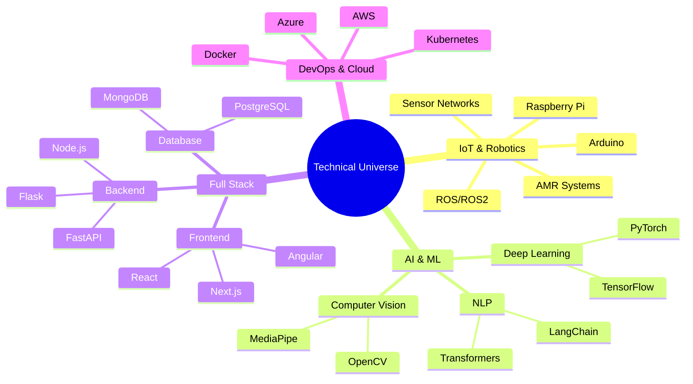

<!-- Header Wave Animation -->
<div align="center">
  
</div>

<!-- Dynamic Typing Animation -->
<div align="center">
  
</div>

<br/>

<!-- Matrix Animation -->
<div align="center">
  
</div>

<!-- Profile Code Block -->
```javascript
class SujanSanjeev {
    constructor() {
        this.name = "Sujan Sanjeev D";
        this.role = "IoT & AI/ML Engineer";
        this.education = {
            degree: "B.Tech CSE (IoT)",
            university: "Shiv Nadar University",
            location: "Chennai"
        };
        this.experience = [
            "Former SWE Intern @ Gorilla Technology",
            "Former SWE Intern @ Tata Communications"
        ];
        this.skills = new Set([
            "🤖 Autonomous Systems",
            "🧠 Deep Learning",
            "🌐 Full Stack Development",
            "🔗 Blockchain",
            "☁️ Cloud Computing"
        ]);
    }

    getCurrentFocus() {
        return [
            "Building Advanced AI Applications",
            "Developing Autonomous Robots",
            "Creating Scalable IoT Solutions"
        ];
    }
}
```

<!-- Snake Animation Workflow File (save as .github/workflows/snake.yml) -->
```yaml
name: Generate Snake Animation

on:
  schedule:
    - cron: "0 */12 * * *"
  workflow_dispatch:

jobs:
  build:
    runs-on: ubuntu-latest
    steps:
      - uses: actions/checkout@v2
      - uses: Platane/snk@master
        id: snake-gif
        with:
          github_user_name: sujansanjeev
          svg_out_path: dist/github-contribution-grid-snake.svg
          
      - uses: crazy-max/ghaction-github-pages@v2.1.3
        with:
          target_branch: output
          build_dir: dist
        env:
          GITHUB_TOKEN: ${{ secrets.GITHUB_TOKEN }}
```

<!-- Snake Animation -->
<div align="center">
  
</div>

<!-- Tech Stack Icons -->
<div align="center">
  <h2>💻 Technical Proficiency</h2>
  
</div>

<!-- GitHub Stats -->
<p align="center">
  
  
</p>

<!-- 3D Contribution Calendar Workflow File (save as .github/workflows/profile-3d.yml) -->
```yaml
name: GitHub-Profile-3D-Contrib

on:
  schedule:
    - cron: "0 */24 * * *"
  workflow_dispatch:

jobs:
  build:
    runs-on: ubuntu-latest
    name: generate-github-profile-3d-contrib
    steps:
      - uses: actions/checkout@v2
      - uses: yoshi389111/github-profile-3d-contrib@0.7.0
        env:
          GITHUB_TOKEN: ${{ secrets.GITHUB_TOKEN }}
          USERNAME: ${{ github.repository_owner }}
      - name: Commit & Push
        run: |
          git config user.name github-actions
          git config user.email github-actions@github.com
          git add -A .
          git commit -m "generated"
          git push
```

<!-- Projects Section -->
<h2 align="center">🚀 Featured Projects</h2>
<div align="center">
  <a href="YOUR_PROJECT_LINK">
    
  </a>
  <a href="YOUR_PROJECT_LINK">
    
  </a>
</div>

<!-- Skills Mindmap -->


<!-- Certifications Section -->
<h2 align="center">🏆 Certifications & Achievements</h2>
<div align="center">
  <table>
    <tr>
      <td align="center">
        <a href="#"></a>
        <br/>
        Google Cybersecurity
        <br/>
        Professional Certificate
      </td>
      <td align="center">
        <a href="#"></a>
        <br/>
        Generative AI Foundations
        <br/>
        DeepLearning.AI
      </td>
    </tr>
  </table>
</div>

<!-- Interests Section -->
<h2 align="center">🎯 Beyond The Code</h2>
<div align="center">
  
  
  
</div>

<!-- Social Links -->
<h2 align="center">🤝 Let's Connect!</h2>
<div align="center">
  <a href="https://www.linkedin.com/in/YOUR_LINKEDIN/">
    
  </a>
  <a href="mailto:sujan21110114@snuchennai.edu.in">
    
  </a>
  <a href="YOUR_PORTFOLIO_LINK">
    
  </a>
</div>

<!-- Footer Wave -->


<!-- Visitor Counter -->
<div align="center">
  
</div>
